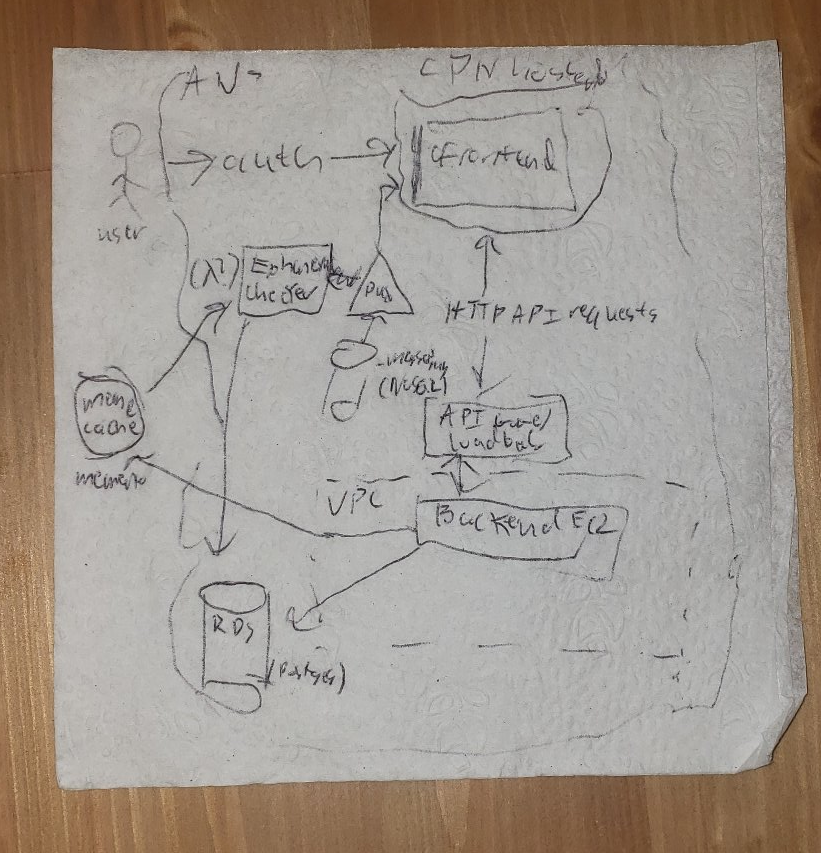
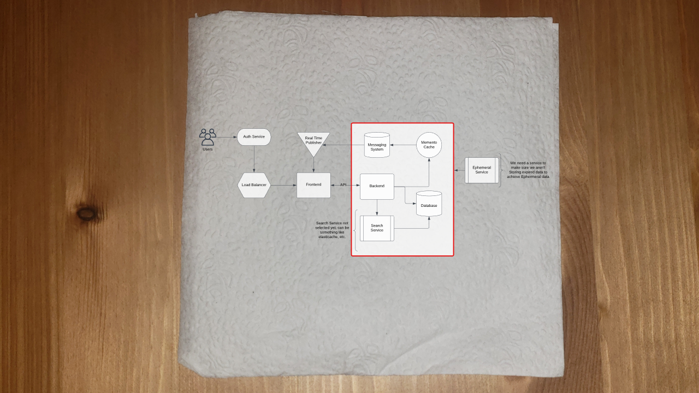
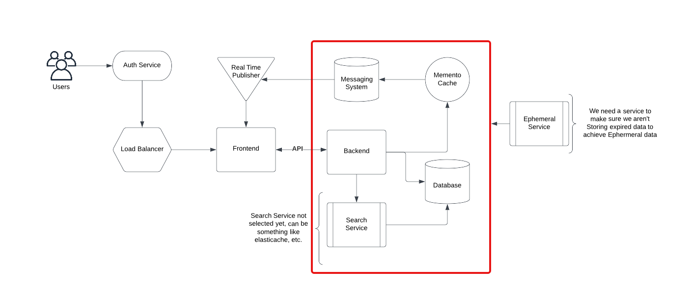
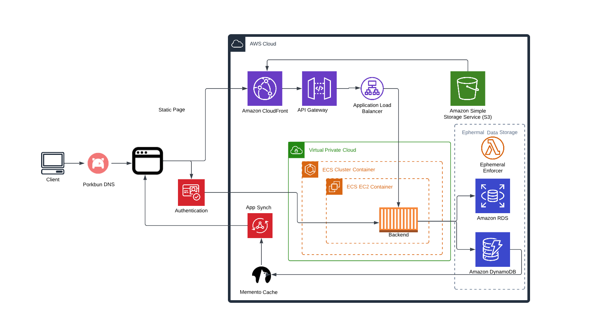

# AWS Free cloud Bootcamp Journal - Week 0

Okay, we are off to a good start with the free AWS cloud bootcamp. Pretty exciting to work on it - I have been working as a Solutions Consultant recommending AWS solutions to clients, and helping software integrator teams develop them, but I am excited to be able to implement one myself that I am not under NDA for.

## Conceptual Diagram

This week we were tasked with creating Architecture diagrams. These are usually done as a shorthand to explain and market cloud services in terms that are digestible to everyone, as well as explain some of the higher technology concepts that are able to power the application (or solution depending on who you ask) that you are working on.

As mentioned in the live stream, they are kind a connected to napkin drawings, like in glass onion. I have never actually seen anyone do a napkin drawing for these kind of things though. Napkins are really poor to write on, people prone to doing this usually have a notebook on them. But I decided to give the napkin thing a go.



Yeah, I guess napkins work okay, but I think we should probably have a second go at it.



There, that's much better.

Here is what I ended up with for the conceptual diagram:
*[Chart Link](https://lucid.app/lucidchart/aa9920f6-bbe5-418d-9f24-4fc180daf472/edit?view_items=rHMwQI5nZLgA%2CrHMwvbxS4hvG%2CrHMw365rg.9K%2CrHMwFA5Owkko%2CrHMwnpTpCLF8%2CrHMwdHx33ru6%2CrHMwQs7lZg3e%2CrHMw8Vv2AuCe%2CrHMwjsCTMXNT%2CrHMwyxQ4Y3-t%2CrHMwLWZlhb8z%2CrHMwawC0Bm.C%2CrHMwPgLieSnO%2CrHMwSW4fYPv2%2CrHMwE0PE.0hA%2CrHMwLPZAGXJz%2CrHMw_RvUCKie%2CrHMwW.BD62a6%2CrHMwP.DkAFs6%2CrHMwvKSUxZDN%2CrHMwB7w1a0vy%2CrHMwM4zoHnHr%2CrHMwgPGWV5OT%2CrHMwscgkKenf%2CrHMwXDaay92C%2CrHMwh6HtS-3m&invitationId=inv_f70217bb-22d9-493b-8f7d-cad947fe1759)*



I didn't make too many changes to what was in class. On the napkin, I considered serving the website statically after looking at some of the code, but there could be some concerns for rate limiting the API access, and since the page involves such dynamic content I figured it would be best to leave that out for now. Especially since it looks like we are deploying with fargate from the course description. Although hosting a static website looks like it is an optional challenge. I am a little torn by this, because ultimately with SPAs with dynamic content there is concerns in the Front end world about filling the page and where to use hydration. Ultimately, with larger apps, you can also start moving to more out their solutions (GraphQL, something like Prisma as an ORM) but we have already outlined that ORMs are a no go and we are not messing with it becaue the CTO or CEO or whatever said so. Oh well.

I also think that there is a key need to outline how we are enforcing the "ephemeral" nature of the messages for Cruddur. This ultimately depends on the actual requirements for the application - if it is just a "nice to have" feature, or if is something that we need to meet a government regulation for. I have worked a lot in the federal contract world where there is a lot of concern about how data is being stored. We definitely don't want to tell users that their data is being deleted and then not doing it(!). I took the lazy way out and modeled this as a separate authoritative service, even if it just provides timestamps that are consistent or something. The main point is to be consistent across every place we are possibly storing data.

## Logical Diagram

*[Chart Link](https://lucid.app/lucidchart/ca9dcfe4-17f6-42b7-b1d3-dee51a7a3d87/edit?invitationId=inv_472672f0-fcea-4e28-a089-da52484d2a9e)*



I ended up modifying the logical diagram back to using cloudfront, just to make it interesting. I also included an API gateway in their. I really don't like how during the live session the design decision was made to give the user access to the backend api because it will "differentiate us from twitter," as topical as that is. The whole point of having the architecture conversations is to think these things though. I would definitely rather have an API managed by the AWS API gateway service, and then choose who we are giving access to. That way, if we decided that we wanted to change how the site was deployed, or give a developer backend API access to our platform, it is easy.

I also modeled in a lambda for the ephemeral data enforcement, just to check if we are storing anything we shouldn't on the databases. I am not sure yet if this is a great way to do things, but I think it is a good trick for talking to stake holders - if there is some functionality that you aren't completely sure about yet, and it appears to be somewhat trivial, it is usually best to call out a lambda that performs it. Of course, this isn't always the best for the final solution if the lambda is going to have to run for a long time, or the task ends up being very copmlicated. But it does show that you are thinking about it.

Finally, I used porkbun dns for the dns provider, since that is where I get my dns. I recommend it for personal dns use.

**Feedback:** Quick note about Lucidcharts - I find their monetization strategy really over reaching and annoying. I get that they have to make money, but I have been supporting them since making H-Bridge model theory diagrams for my controls classes in 2012. At least give us a self hosted option.

I have since moved on to draw.io, which has support for the AWS service icons, and even has a nextcloud pluggin for ease of use, self hosted. I am a big fan of self hosting, and there should be a self hosted option for just about everything in a cost concious workshop.

Oh well, I have found most people just end up using PowerPoint or google slides to make these diagrams honestly. I was stuck in the enterprise space though...

## Cloud Build Diagram

*[Chart Link](https://lucid.app/lucidchart/e8ad7466-22a1-4db4-a889-574f7411ed5e/edit?view_items=U4MwLLSTTjVb%2CVUMw7EDwjdqD%2CoWMwOkhLAkNJ%2CeYMwbYnLSiUO%2CxYMwy5EZDEnU%2CmZMwown_fxgV%2CnIMwdJGzOgiD%2Ct9Mwq2ehwKQS%2CnIMwGM~eQtwn%2CnIMwi.6gtXyd%2CnIMw-6~mDmpJ%2Ct5MwCeKQFbti%2Cd9Mwm9kFPPZI%2CnIMwR7iEpavb%2CYWMw9VzbaR1p%2Cf9Mw4Moyd~h1%2CH5Mw6TKxpfpZ%2C34Mwb17Y1g2E%2CnIMwGfE6zhxS%2CnIMwztnG0tyP%2CdYMw6XdgAlZs%2CnIMwrQC2O8sA&invitationId=inv_1578a9cc-2a84-4626-8d4f-76aa07b2eebc)*


The actual CI/CD pipeline is very simple, because AWS packages up the services for you. Most people go ahead and use the Github actions for more hobby stuff, while clients I have worked with in the past are very stuck on Jenkins. I didn't want to speculate too much about what the actual built code is going to be doing, but usually you do want to save build logs and have them get cleared out. I have actually not used the AWS cloud build tools that much, but ideally there is a way to configure how long we save the build log files.

If the code is built and passes all of its tests, it get's deployed. Probably to a test environment for integration testing, but I am not focusing on that in this diagram. I listed a couple possible targets for the built code to get deployed to, but it could get delivered anywhere.

## AWS Security, Billing, and Other Setup

I have a lot of this stuff already set up with AWS from previous projects, but I went and I created a user group specifically for this bootcamp so I can have granular control over the service privileges. I also went ahead and set up the event bridge sub, although I will probably leave it disabled for now. I don't like receiving emails for trivial services, although I will have it open when submissions start. Just something simple for the pattern matching:

```JSON
{
  "source": ["aws.health"],
  "region": ["us-west-2"]
}
```

I will be hosting out of `us-west-2`.

As far as budgets go, I will stick with my usual hobby project budget of 1 dollar per month, and we will go from there.


I get an email to a few accounts I use if I go over.

I'm also going to skip the support ticket for quotas. If we go over a service quota for this workshop, I will be really surprised. Let's also not bother the support ticket team - I used to work in customer service, this is a waste of their time.

## AWS Well Architected

I also went ahead and created a well architected workload for cruddur. Generally I am not a fan of these things, since they are made more for sales - generally I would rather do project management, design and planning in a tool that is a bit more decoupled from AWS. But I will probably spend the rest of the week filling out all the elaborate planning questions for the well architected pillars, in good faith.


## Course setup - Gitpod, AWS CLI, 

After reading through some of the discord, it look like there is a strong preference for having the gitpod environment up and running. I just want to point whoever is grading this to the `.gitpod.yml` and the aws json settings I ended up configuring to use. I do have gitpod up and running with the AWS CLI.

I also redid a lot of the topic subscription and alarm creation with the `aws sns` and `aws budgets` cli commands.


## Conclusion

Well, that's it for week 0! Thanks to the organizers and guest lecturers for walking everyone through these things for free, plus also for all the work that clearly went into the roleplay scenario planning. I'm really looking forward to next week, since I love containers and docker.