# AWS Free cloud Bootcamp Journal - Week 1

I'm very excited to do the week 1 activities. I am a hug fan of docker ever since it made installing ROS2 a breeze during my robotics days. They didn't have docker when I was doing my undergrad research with ROS (Robotic Operating System).

Just want to note, that I am starting this journal before the livestream to get a jumpstart on everything, so I might get some errors that will be fixed by the start of the official working period

## Backend Docker Image

I was able to get the backend flask container open. Here is the docker ps from gitpod:

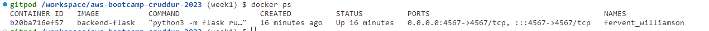

created with

```bash
CONTAINER_ID=$(docker run --rm -p 4567:4567 -d backend-flask)
```

Out of the box, going to the listed api in the week1 journal example, I get this error:

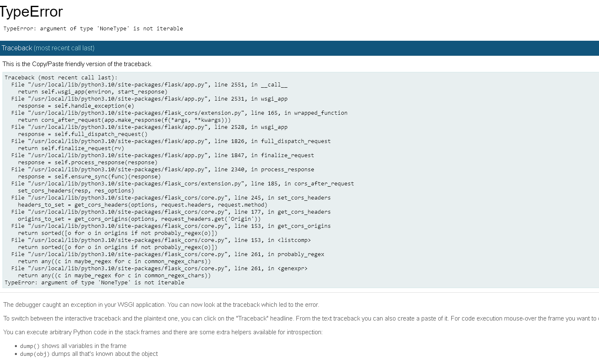

Looks like python is running into an error at line 2551 of `app.py`. It's ultimately saying that flask is trying to call an iterable method on a non iterable object, so something either got passed in wrong in `app.py`, or there are some setup steps for the backend that I am currently missing (I am doing this prior to the livestream, so I'm sure Andrew is hard at work fixing stuff like this). There are also a couple of CORS file being referenced, so it could be a cross origin issue. I'm going to dig in and start journaling again once I figure it out.

## Frontend Docker Image

Frontend Docker image is working great:

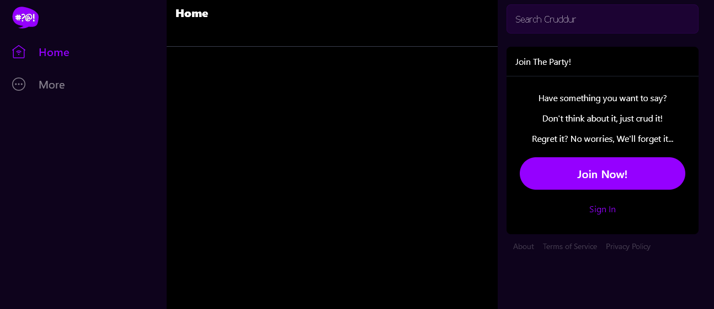

cruddur frontend is up right now.

created with

```
docker run -p 3000:3000 -d frontend-react-js
```

docker ps:

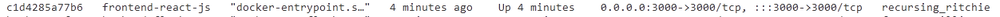

## Backend Fix

Ends up it was just an issue with the backend application needing to know the url it was running at, which is passed through an environment variable. Andrew ran into the same issue in the livestream. The docker compose file provides these, so running it through the docker compose file makes everything work:

**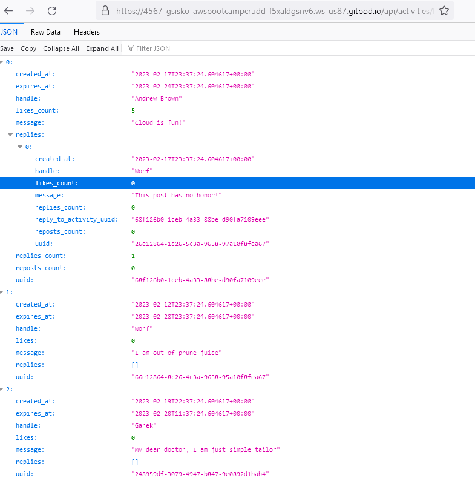**

I actually recently switched from chrome to firefox, and I have to say, it formats JSON responses way better than chrome.

# Updating Docker-Compose

We have to update the `docker-compose.yml` to make everything work together. Here is where I have landed so far:

```Yaml
version: "3.8"
services:
  backend-flask:
    environment:
      FRONTEND_URL: "https://3000-${GITPOD_WORKSPACE_ID}.${GITPOD_WORKSPACE_CLUSTER_HOST}"
      BACKEND_URL: "https://4567-${GITPOD_WORKSPACE_ID}.${GITPOD_WORKSPACE_CLUSTER_HOST}"
    build: ./backend-flask
    ports:
      - "4567:4567"
    volumes:
      - ./backend-flask:/backend-flask
  frontend-react-js:
    environment:
      REACT_APP_BACKEND_URL: "https://4567-${GITPOD_WORKSPACE_ID}.${GITPOD_WORKSPACE_CLUSTER_HOST}"
    build: ./frontend-react-js
    ports:
      - "3000:3000"
    #TODO: this won't work, becuase we need to build the web app when we spin the container up,
    #we can install it manually, but we can run into issues when porting this stuff, will consider
    #adding build commands to docker compose
    #volumes:
    #  - ./frontend-react-js:/frontend-react-js
  db:
    image: postgres:13-alpine
    restart: always
    environment:
      - POSTGRES_USER=postgres
      - POSTGRES_PASSWORD=password
    ports:
      - '5432:5432'
    volumes: 
      - db:/var/lib/postgresql/data
  dynamodb-local:
    # https://stackoverflow.com/questions/67533058/persist-local-dynamodb-data-in-volumes-lack-permission-unable-to-open-databa
    # We needed to add user:root to get this working.
    user: root
    command: "-jar DynamoDBLocal.jar -sharedDb -dbPath ./data"
    image: "amazon/dynamodb-local:latest"
    container_name: dynamodb-local
    ports:
      - "8000:8000"
    volumes:
      - "./docker/dynamodb:/home/dynamodblocal/data"
    working_dir: /home/dynamodblocal
# the name flag is a hack to change the default prepend folder
# name when outputting the image names
networks: 
  internal-network:
    driver: bridge
    name: cruddur

volumes:
  db:
    driver: local
```

After making sure the port forwarding was public, I was able to get the application to work pretty smoothly: 

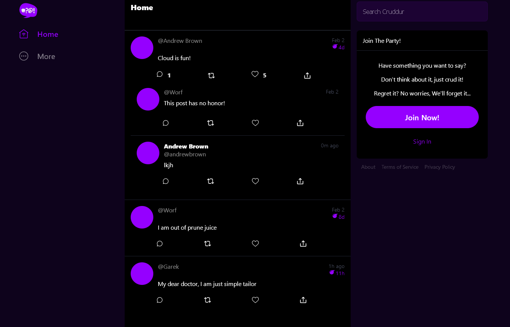

## Adding Notifications Endpoint

The first step to adding the notifications endpoint is to add it to our open api spec. I was able to just grab it from the reference repo:

```yaml
/api/activities/notifications:
    get:
      description: 'Return a feed of activity for all of those that I follow'
      tags:
        - activities
      parameters: []
      responses:
        '200':
          description: Returns an array of activities
          content:
            application/json:
              schema:
                type: array
                items:
                  $ref: '#/components/schemas/Activity'
```

One thing to mention is that you just have the yaml tool open in the editor for the API extension for the vscode editor (running through gitpod) to see it.

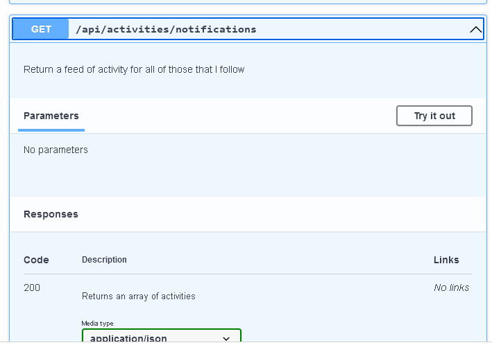

After that all that is left is to implement the endpoint in flask and have it return some mock data:

### app.py

```python
@app.route("/api/activities/notifications", methods=['GET'])
def data_notifications():
  data = NotificationsActivities.run()
  return data, 200
```

### notifications_activities.py

```python
from datetime import datetime, timedelta, timezone
class NotificationsActivities:
  def run():
    now = datetime.now(timezone.utc).astimezone()
    results = [{
      'uuid': '68f126b0-1ceb-4a33-88be-d90fa7109eee',
      'handle':  'cherry',
      'message': 'Take me to funky town',
      'created_at': (now - timedelta(days=2)).isoformat(),
      'expires_at': (now + timedelta(days=5)).isoformat(),
      'likes_count': 5,
      'replies_count': 1,
      'reposts_count': 0,
      'replies': [{
        'uuid': '26e12864-1c26-5c3a-9658-97a10f8fea67',
        'reply_to_activity_uuid': '68f126b0-1ceb-4a33-88be-d90fa7109eee',
        'handle':  'patrick',
        'message': 'I wumbo, you wumbo, he/she wumbo, wumbology',
        'likes_count': 4,
        'replies_count': 0,
        'reposts_count': 2,
        'created_at': (now - timedelta(days=2)).isoformat()
      },
      {
        'uuid': '8c4e7d6e-b17f-11ed-afa1-0242ac120002',
        'reply_to_activity_uuid': '68f126b0-1ceb-4a33-88be-d90fa7109eee',
        'handle':  'gene',
        'message': 'Moses supposes his toeses are roses',
        'likes_count': 6,
        'replies_count': 0,
        'reposts_count': 8,
        'created_at': (now - timedelta(days=1)).isoformat()
      }
      ],
    }
    ]
    return results
```

I had some fun coming up with the [mock data](https://www.youtube.com/watch?v=tciT9bmCMq8).

## Adding Notifications Front End

After that I did the requisite steps to add the notificaitons to the front end. I am not going to bother repasting the code. You can check `NotifcationsFeedPage.js` and `App.js` in my `frontend-react-js` directory. But the mock data is displaying in Cruddur:


### Docker Compose bug

I am currently running into an issue on gitpod with docker compose - it is not letting me mount my front end code directory as a volume, which is annoying because it means I have to rebuild my container every time I deploy it (`docker-comopose up --build`) so that it can copy in the code for when I make updates. Right now I am getting a `code 127` error when I try deploying with the mounted volume (check my `docker-compose.yml` to see what I am talking about, I comented it out):
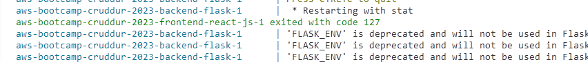

Luckily it is not too bad right now, but I definitely will do a deep dive into figuring this out once I finish the work for week 1. I don't think that it is a line ending error, which is the first thing that stack overflow suggested.

## DynamoDB local and Postgres containers.

I was already running the DynamoDB local and Postgresql containers, but I did a few things to test that they are workign as needed. First the DynamoDB containers with the 100 days of code challenge examples. I was able to load all of the items in from the challenge examples, and then perform a query on the data:
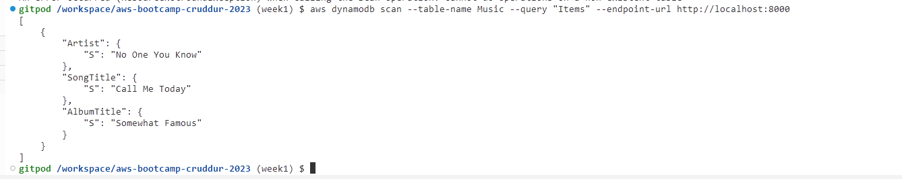

For postgres, it is recommended to install `psql` in order to log in and verify it. I'll end up doing this this week, but just to make things a bit faster and easier, and a little bit more "stateless" from gitpod.io point of view, I am going to use *adminer*. *Adminer* is a very simple web app team that gives you an interface to log into database servers. It even has a pretty well maintained docker image deployment. It is very easy to add to the services in your docker-compose.yml:
```yaml
adminer:
    image: adminer
    restart: always
    ports:
      - 5433:8080
```

and next time you use `docker-comopse up` it will be ready for you on the port you speficied (or the reverse-proxied domain for that port in gitpod's case):
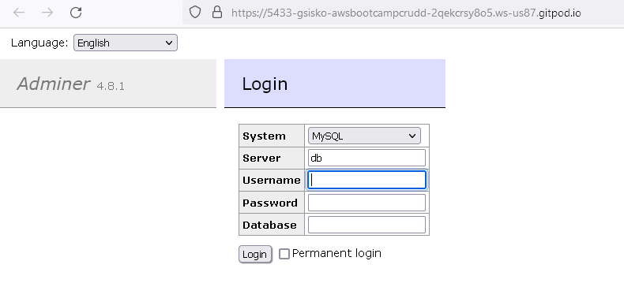

Sure enough we can log in to the database: 
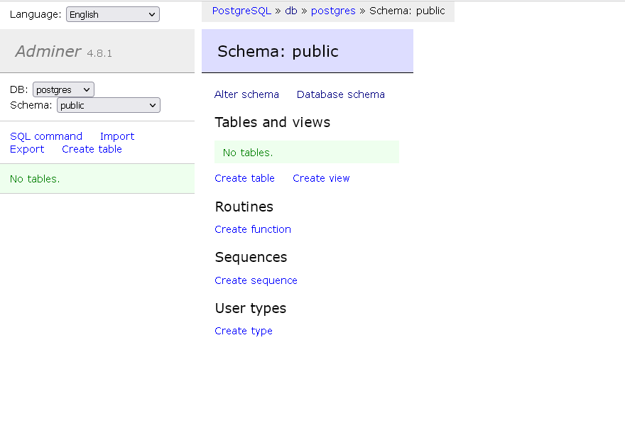

Here is the psql output, just so you know I was able to install psql on gitpod:

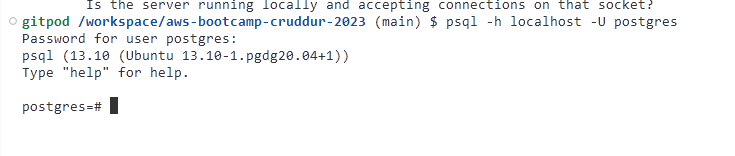

But I still prefer adminer.

## .gitignore

Calling out my `.gitignore` because it came up on the video. You probably don't want to commit data base files to git, since they are runtime artifacts.

```gitignore
# Data base dumb file artifacts
docker/*
*.db
```

I'll also add some other file types for node, python, and docker in there. I'm sure there are some aws things that need to get added as well.

And that concludes this weeks work!

## Feedback

I am going to leave a section at the end of my journals for various feedback I didn't include in the work journaling. 

I'm still pretty ahead of schedule, I finished this on the monday of the week, so I will probably move on to the next weeks activities. Eventually I might try to go off course and make everything myself and then check in week to week to document it for homework purposes.

But since I have free time, the first thing to pursue will be to write a technical article referencing the class. I have started drafting one that shows how to use dev containers to  do all of this work locally in docker and with a standardized development environment that doesn't depend on a paid service, although I will make it perfectly clear that anyone actually participating in the bootcamp should also be maintaing this in gitpod so that the graders can check our work easily.

I also might want to write and article about `chroot` and its relationship to docker conatiners, since that would clear up a lot of the confusion Andrew has about them. 