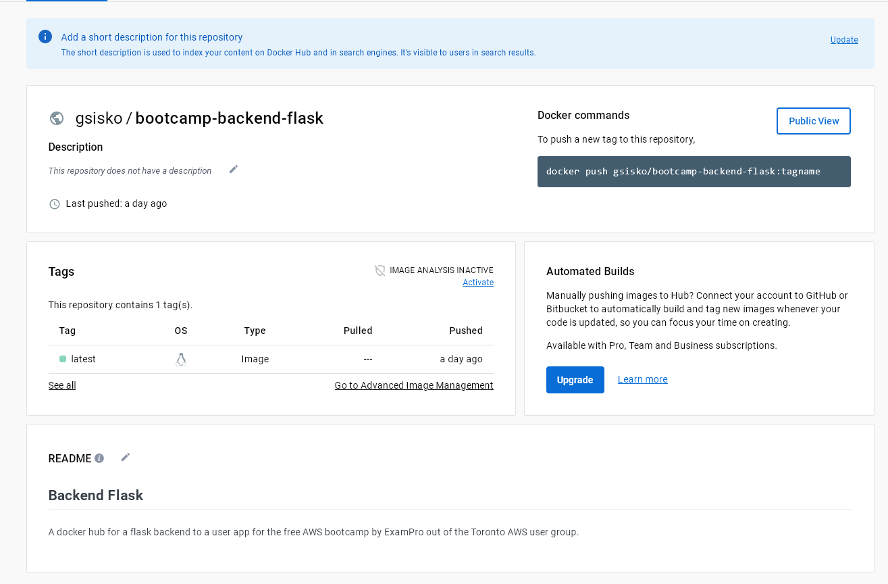
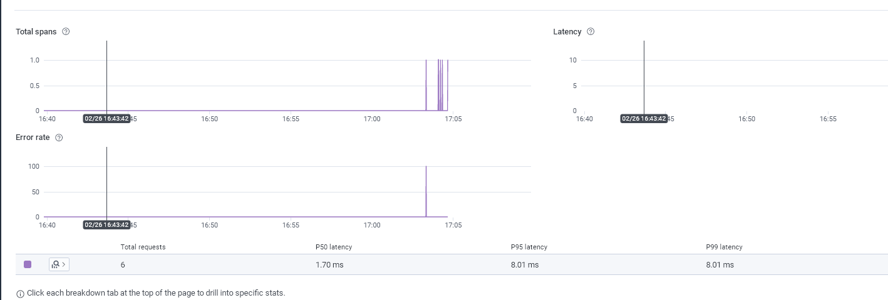
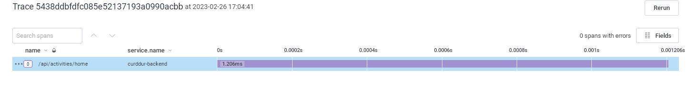
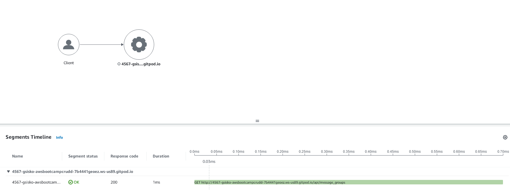
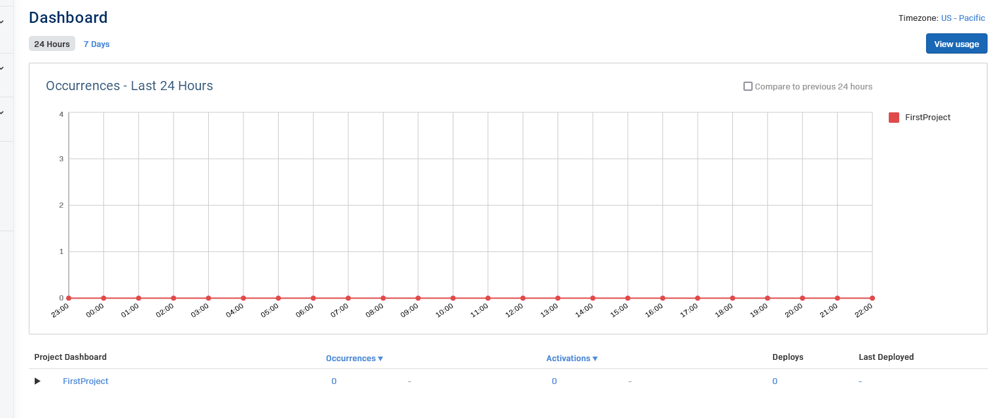

# AWS Week 1 Stretch Assigments

I submitted my week 1 assignment early due to some sheduling conflicts. Luckily I was able to go back and do a couple of the stretch assigments.

This includes implementing a health check in the docker compose file. I just used a `curl` check, if I had more time I would have probably followed something a little more specific to the Local DynamoDB image:

```yaml
 dynamodb-local:
    # https://stackoverflow.com/questions/67533058/persist-local-dynamodb-data-in-volumes-lack-permission-unable-to-open-databa
    # We needed to add user:root to get this working.
    user: root
    command: "-jar DynamoDBLocal.jar -sharedDb -dbPath ./data"
    image: "amazon/dynamodb-local:latest"
    container_name: dynamodb-local
    ports:
      - "8000:8000"
    volumes:
      - "./docker/dynamodb:/home/dynamodblocal/data"
    working_dir: /home/dynamodblocal
    healthcheck:
      test: "curl http://localhost:8000"
      interval: 10s
      timeout: 30s
      retries: 5
      start_period: 30s
```

I also uploaded my backend docker image to dockerhub:



# AWS Free cloud Bootcamp Journal - Week 2

Week 2 is all about tracing and logging. My plan to complete it is to start updating my code the previous Friday the 24th, and then do some logging events the following week following whatever andrew does on the video, and then go after the extra suggested steps.

## Distributed Tracing Technologies:

### Rollbar

Rollbar is distributed error reporting and code issue logging tool. It aggregates and logs code errors through an sdk. We can add it to our backend `app.py` file through this python code:

```python
rollbar_access_token = os.getenv('ROLLBAR_ACCESS_TOKEN')
@app.before_first_request
def init_rollbar():
    """init rollbar module"""
    rollbar.init(
        # access token
        rollbar_access_token,
        # environment name
        'production',
        # server root directory, makes tracebacks prettier
        root=os.path.dirname(os.path.realpath(__file__)),
        # flask already sets up logging
        allow_logging_basic_config=False)

    # send exceptions from `app` to rollbar, using flask's signal system.
    got_request_exception.connect(rollbar.contrib.flask.report_exception, app)
```

This will grab the access key and environment from our gitpod workspace and connect to a rollbar service account. The `got_request_exception.connect` function connects our flasks exception reporting system to rollbar to start reporting events.

### Honeycomb

Honeycomb is a provider for aggregation of Open Telemetry data. Open Telemetry data includes the usage of REST endpoints, and information about how they ran, as well as when they were called (instead of just the errors and exceptions from rollabar).

**Note:** One thing I want to point out is that this can potentially generate a lot of data, which can become a pricing concern if we are collecting telemetry at scale from a service running on ec2. I would wonder if there is a better way to collect telemetry data within the same availability zone, although I would have to inspect the data usage to see if it is really a concern. Although it looks like cloud watch supports open telemetry data.

One thing to notice is that to send data to honeycomb, we don't use a Honeycomb SDK, but an SDK for open telementry data

```python
# HoneyComb ------
from opentelemetry import trace
from opentelemetry.instrumentation.flask import FlaskInstrumentor
from opentelemetry.instrumentation.requests import RequestsInstrumentor
from opentelemetry.exporter.otlp.proto.http.trace_exporter import OTLPSpanExporter
from opentelemetry.sdk.trace import TracerProvider
from opentelemetry.sdk.trace.export import BatchSpanProcessor
```

Open Telemetry in python looks like it has support for a flask tracer:

```python
# Initialize tracing and an exporter that can send data to Honeycomb
provider = TracerProvider()
processor = BatchSpanProcessor(OTLPSpanExporter())
provider.add_span_processor(processor)
trace.set_tracer_provider(provider)
tracer = trace.get_tracer(__name__)
```

* * *

```python
# HoneyComb -------
FlaskInstrumentor().instrument_app(app)
RequestsInstrumentor().instrument()
```

It looks like we provide tracer honeycomb access information to environment variables in the docker compose file:

```yaml
environment:
   - OTEL_EXPORTER_OTLP_ENDPOINT: "https://api.honeycomb.io"
   - OTEL_EXPORTER_OTLP_HEADERS: "x-honeycomb-team=${HONEYCOMB_API_KEY}"
   - OTEL_SERVICE_NAME: "${HONEYCOMB_SERVICE_NAME}"
```

Pretty excited to try this. I also definitely want to try hosting my own Open Telemetry data service provider (exporter? I will have to learn the terminology).

### AWS X-Ray

AWS X-Ray is AWS's native data analyzing and tracing tool. Utilizing it first means setting it up with `awscli`:

```bash
aws xray create-sampling-rule --cli-input-json file://aws/json/xray.json
```

* * *

```json
{
  "SamplingRule": {
      "RuleName": "Cruddur",
      "ResourceARN": "*",
      "Priority": 9000,
      "FixedRate": 0.1,
      "ReservoirSize": 5,
      "ServiceName": "Cruddur",
      "ServiceType": "*",
      "Host": "*",
      "HTTPMethod": "*",
      "URLPath": "*",
      "Version": 1
  }
}
```

Connecting in `app.py` is easy:

```python
from aws_xray_sdk.core import xray_recorder
from aws_xray_sdk.ext.flask.middleware import XRayMiddleware

xray_url = os.getenv("AWS_XRAY_URL")
xray_recorder.configure(service='Cruddur', dynamic_naming=xray_url)
XRayMiddleware(app, xray_recorder)
```

There is also a daemon that can relay information to the x-ray service. I would like the livestream to go over whether that works as a self hosted provider for traced data, or if it is there to merely relay data through to the managed xray service on aws.

We can run the xray daemon from our `docker-compose.yml` file:

```yaml
  xray-daemon:
    image: "amazon/aws-xray-daemon"
    environment:
      AWS_ACCESS_KEY_ID: "${AWS_ACCESS_KEY_ID}"
      AWS_SECRET_ACCESS_KEY: "${AWS_SECRET_ACCESS_KEY}"
      AWS_REGION: "us-east-1"
    command:
      - "xray -o -b xray-daemon:2000"
    ports:
      - 2000:2000/udp
```

## Connecting Honeycomb

Okay, so the stream went over well, and sure enough it is time to start connecting everything. The submissions page for week 2 hasn't activated yet, but for now it is pretty straightforward to start tackling the activities. The first step would to set up honeycomb. Once we export the correct environment variable in our dockerfile:

```yaml
OTEL_EXPORTER_OTLP_ENDPOINT: "https://api.honeycomb.io"
OTEL_EXPORTER_OTLP_HEADERS: "x-honeycomb-team=${HONEYCOMB_API_KEY}"
OTEL_SERVICE_NAME: "curddur-backend"
```

Everything seams to be working:


However the trace is extremely simple, but that is probably because I need to implement more traceability between my services. I will probably focus on that if I have enough time after setting a few of the other visibility services up:


## Instrmenting XRay

Now that honeycomb is going it is time for XRay. I created an XRay sampling rule using the `awscli`:

```bash
aws xray create-sampling-rule --cli-input-json file://aws/json/xray.json
```

Which appears in my sampling rules. It was a bit confusing to find, but it is in CloudWatch settings in the AWS Cloud Console. Once I start sending some data to it, we are looking good. We end up with a trace and service map:



## Setting up Rollbar

Rollbar also went smoothly without issue:



## Extra Work - Insturmenting Front End

I have some of this working in a test account, but I don't feel great about the shape that it is in for this weeks submission. I'll add it for next week when I have more time. Cheers!


