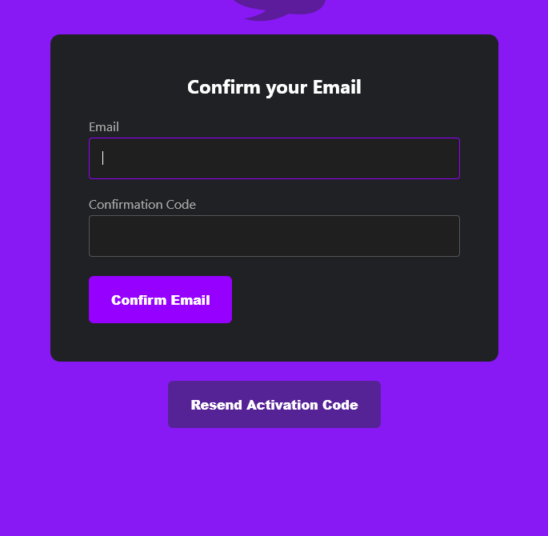

# AWS Free cloud Bootcamp Journal - Week 3

This week, I am going a little bit off script in order to speed up using cognito. Andrew was complaining on the stream that the user experience isn't good compared to Firebase. I definitely agree, but the trick to using Cognito Auth and amplify is to treat it like any other AWS service and use the command line. Unfortunately, I don't believe that AWS will ever seriously try to compete with google on these fronts, and instead just offer it as a service so that they can provide all services for apps in one place.

## Updating our front end

First thing that I am going to do is implement all the custom pages in the front end app.is to add amplify and cognito support. I am not going into detail about this. I am mostly just updating the files from the `week3-again` branch of the reference repository. I will be sure to add in screenshots of the pages once I get them up and running.

## Installing amplify as a Dependency

As per instructions, I used `npm i aws-amplify --save` to do this in the front end application directory. It was worth noting that it added `"aws-amplify": "^5.0.18"` to my project dependecies. This will get installed into the front end docker image *when it is rebuilt*.

## Creating our User Pool

Instead of using the graphical user interface, we are going to use the AWS CLI, which we already went through all the trouble installing into gitpod. This is definitely the way that would prefer to use incognito if my project required it, rather than switching to firebase.

You can set up a minimal user pool with:
```bash
aws cognito-idp create-user-pool --pool-name CruddurUserPool
```

The CLI will create it and output json with the creation information:


I crossed it out, but that is what supplies us with our user id. Now I can use a CLI tool like `jq` or a resource management tool like Cloudformation or Terraform to automate the creation of Cognito resources, and still consume services straight from AWS. Pretty nifty.

I will also be creating the client id from the CLI:

```
aws cognito-idp create-user-pool-client --user-pool-id us-west-1_6BpkgoczU  --client-name MyNewClient --no-generate-secret
```
 
 Apparently we should also be restriction the auth to specific flows, but we are just going to let cruddur authenticate with the user pool from now. This outputs this json on the command line:
 
 
 
 So now we have our Client ID. I just passed these into gitpod environemnt variables.
 
 We have both the user pool and the client ID in our web console too:
 
 
 
 
 ## Gettting everything running
 
 Okay, now that Everything is in place, we just have to have gitpod rebuild our workspace to make sure all of our environment variable are in place, and we are good to go. I am also giving everything a no-cache build.
 
 I am a little frustrated with this build process. I hate relying on cache validation for building, because it tends to result in various frustrating to debug errors, so perhaps it will be a good target for a technical article to explore how to make the build process better. I guess it isn't that  bad - it took 78 seconds on gitpod.
 
 Okay, everything is up and running. Let's try signing in:
 
 
 
 And it asks us for a confirmation code: 
 
 
 
 Right now, I am having trouble getting cognito to send the confirmation email - I am using tempmail, I don't want to put my email in. I will have to look into whether AWS is filtering it, if it is on tempmail's side, or if it is just taking a while to generate the code. That will make a nice addendum to the journal entry, but right now I am impatient and want to see this work, so we are going to verify manually through the cloud console and confirm the account:
 
 
 
 
 
 
 
 And sure enough, we are now logged in:
 
 
 
 I got the recovery page in there too:
 
 
 
 ## Wrapping up, and status
 
 In case you have noticed, I have been unable to complete stretch assignments due to some time constraints on my side that stem from professional concerns. I understand that this will impact my "badge" status. Thanks for understanding. I am still going to try to at a minimum get through the course work. Next week is also busy for me, but I should resume to work on some of the stretch assignments the week after that.
 
 ## Addendum: Email verifcation
 
 Whoops, accidentally forgot to set up the user pool with Email verifcation for account signup. 
 
 Now we get a verification code:
 
 
 
 
 
 And sure enough, we can log in:
 
 
 
 And users are showing up in our user pool:
 
 
 
 We can also customize the message straight from the command line, by providing a message template which is nice.
 
 I'm still looking into whether we can enable this in the command line. I think the prefered method is to set up an amil fprovider, which can be done easily with AWS Simple Email Service.
 
 ## JWT Validation middleware
 
 Okay, I actually did implement the JWT validation middleware, using the [aws-labs reference](https://github.com/awslabs/aws-support-tools/blob/master/Cognito/decode-verify-jwt/decode-verify-jwt.py).
 
 ```python
# Copyright 2017-2019 Amazon.com, Inc. or its affiliates. All Rights Reserved.
#
# Licensed under the Apache License, Version 2.0 (the "License"). You may not use this file
# except in compliance with the License. A copy of the License is located at
#
#     http://aws.amazon.com/apache2.0/
#
# or in the "license" file accompanying this file. This file is distributed on an "AS IS"
# BASIS, WITHOUT WARRANTIES OR CONDITIONS OF ANY KIND, either express or implied. See the
# License for the specific language governing permissions and limitations under the License.
#
# Modified for use in aws-cruddur-bootcamp-2023
import json
import time
import urllib.request
from jose import jwk, jwt
from jose.utils import base64url_decode

import sys
import os


region = xray_url = os.getenv("AWS_DEFAULT_REGION")
userpool_id = xray_url = os.getenv("COGNITO_USER_POOLS_ID")
app_client_id = xray_url = os.getenv("COGNITO_WEB_CLIENT_ID")
keys_url = 'https://cognito-idp.{}.amazonaws.com/{}/.well-known/jwks.json'.format(region, userpool_id)
# instead of re-downloading the public keys every time
# we download them only on cold start
# https://aws.amazon.com/blogs/compute/container-reuse-in-lambda/
# TODO: Must refresh to get new keys if long running application, I must look into this
with urllib.request.urlopen(keys_url) as f:
  response = f.read()
keys = json.loads(response.decode('utf-8'))['keys']


# Get the claims 
def get_claims(event):
    token = event['token']
    # get the kid from the headers prior to verification
    headers = jwt.get_unverified_headers(token)
    kid = headers['kid']
    # search for the kid in the downloaded public keys
    key_index = -1
    for i in range(len(keys)):
        if kid == keys[i]['kid']:
            key_index = i
            break
    if key_index == -1:
        print('Public key not found in jwks.json')
        return False
    # construct the public key
    public_key = jwk.construct(keys[key_index])
    # get the last two sections of the token,
    # message and signature (encoded in base64)
    message, encoded_signature = str(token).rsplit('.', 1)
    # decode the signature
    decoded_signature = base64url_decode(encoded_signature.encode('utf-8'))
    # verify the signature
    if not public_key.verify(message.encode("utf8"), decoded_signature):
        print('Signature verification failed')
        return False
    print('Signature successfully verified')
    # since we passed the verification, we can now safely
    # use the unverified claims
    claims = jwt.get_unverified_claims(token)
    # additionally we can verify the token expiration
    if time.time() > claims['exp']:
        print('Token is expired')
        return False
    # and the Audience  (use claims['client_id'] if verifying an access token)
    if claims['aud'] != app_client_id:
        print('Token was not issued for this audience')
        return False
    # now we can use the claims
    print(claims)
    return claims
        
# the following is useful to make this script executable in both
# AWS Lambda and any other local environments
if __name__ == '__main__':
    # for testing locally you can enter the JWT ID Token here
    event = {'token': sys.argv[1:]}
    get_claims(event, None)
```

and then a decorator funciton to clear the auth: in app.py

```python
# Verify wrapper
def verify_token(func):
  '''verify security claims of authorization headers before executing function'''
  def wrapper():
    validated_claims = get_claims(request.authorization)
    if ' ' in validated_claims:
      func()
    else:
      error_output = 'Invalid api call from {} for {}'.format(request.full_path,request.endpoint)
      print(error_output)
      #TODO add logging here.
```

This can be used as a decorator before a funciton route as `@verify_token` to make sure the app only runs if there is the valid authorization header.

I am writing this code for the sake of the homework, however I am not actually going to use it. This is because I strongly believe that this is a bad idea to do at this stage of development, before we have even settled on the applicaiton infrastructure architecture. We will definitely be chaning where the backend is running, and as alluded to in the homework, you should probably be doing the authroization in a separate layer, whether that is AWS gateway, or a network layer proxying solution like Envoy. 

Furthermore, it is also unclear whether we should be using  a full amplify applicaiton to set the request headers at an application level.

I don't even like that we are performing jwt validation in the backend app itself honestly. A lot of developers actually do this wrong, and merely verify the claims in the JWT rather than validating them against known valid signers, which have to be retrieved from `https://cognito-idp.{}.amazonaws.com/{}/.well-nown/jwks.json'.format(region, userpool_id)`. And if you don't know how your app is running, it is unclear how you should be caching these signer keys and storing them. Even the example just has it do it on the lambda cold boot and leave it at that, which doesn't strike me as the best strategy.

So, even though JWTs are very fascinating, they can be quite tricky, and there are a lot of semantics.A lot of very competent web engineers advocate for them not to be used for [a simple applciation architecture](https://apibakery.com/blog/tech/no-jwt/), which is what we currently have (but the purpose of the workshop is to push towards microservices, so I get it). If we are already using a managed IAMs service like incognito though, we should also depend on one for the request authroization.

Anyway, that is it. It should probably be mentioned in some of the course videos. JWTs are quite complex and people argue over them a lot. It is nice that AWS cognito manages them for you, but you can still get into a lot of trouble.

## Last note

There also seems to be a problem with the app not being signed in for multiple panels, so I will try to fix that by next week. I am pretty sure it is a problem with andrew's github as well. Could be a token thing, I will check and have an answer next week.