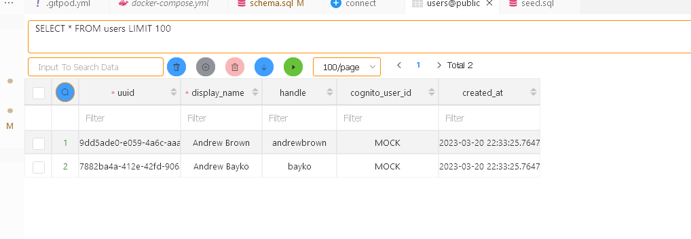
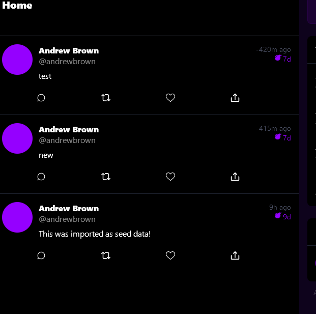
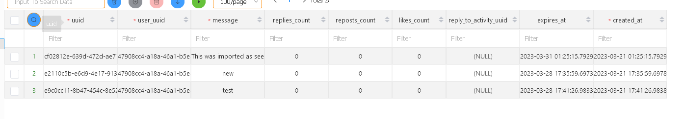
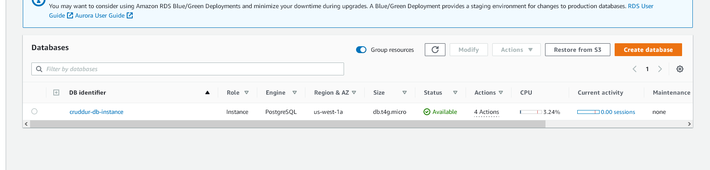
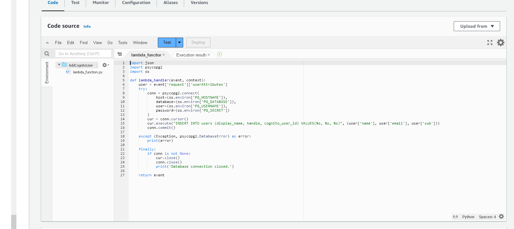

# AWS Free cloud Bootcamp Journal - Week 4

I got a little sick on week 4, so unfortuantely I am submitting this late. Although I did really appreciate the comments on my graded work.

## Postgres SQL setup

This week is all about setting up our relational database backend and then re-hosting it on AWS RDS. We already set up a container to run postgres, so as outlined in the reference repository, we have to connect to the container instance and set up our database.

### Schema

First thing do do is add the schema sql for initializing the tables. First by importaing a UUID generator extension, and then setting up the tables with the proper schema. Please jusing going to refer to the `db` directory.

The scripts are easy enough to apply - here is what we see after we create the database tables and seed them:

I might add some more seed values.

## Utility scripts

I went a head and added all the utility scripts to the repository. One thing I noticed is that in the repository. One thing I noticed is that in the reference repository they are in the `backend-flask` directory, when they should be in root. The scripts themselves refer to themselves in the root directory, so I am assuming this gets fixed somewhere on another branch or something.   

I also changed the database env variables to `DB_CONNECTION_URL` to make it clear it is for the database.

## Creating activities

I was able to implement creating actitivies using the create activities service. One thing I noticed is that currently, the app creates the activity as Andrew Brown, and not as the currently logged in user. 

This is mirrored on the backend database

## Connecting to RDS

I was able to set up the data base on RDS and connect to it.

I also went ahead and set up the lambda function

I am going to hold off on developing on this for a bit because connecting the lambda to the RDS instance involves creating an endpoint in the RDS vpc. I mostly want to develop on the locally hosted instance. without setting up the gateway because it starts becoming a real material cost since I don't have free-tier on my aws account. But you do need to set up the gateway endpoint.

## Refactor

I am putting together a list of things to refactor, and I am going to include it in my journal for either this weeks submission or next weeks submission. I am still planning out how it will affect my course work because I am already running into instances where decisions that I make about how i want my version of the app to be written are different, and I don't want to get into branching trouble. But since I do have more time now, I will think of a way to both have the regular work 

**Potential Targets:** 
- Create local backup of Lambda funcitons with serverless or openfaas framework.
- Modify backend directory structure to be more pythonic.
- Modify Frontend to properly use AWS Amplify for authentication.

